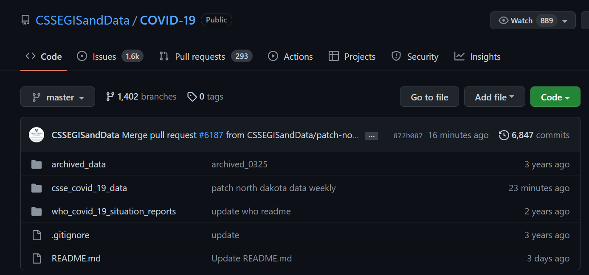
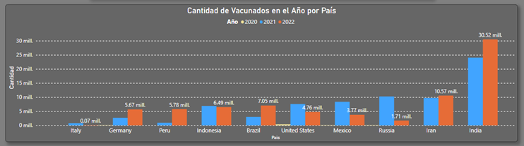

UNIVERSIDAD NACIONAL MAYOR DE SAN MARCOS  FACULTAD DE INGENIERÍA DE SISTEMAS E INFORMÁTICA   E.A.P DE INGENIERÍA DE SOFTWARE

**Proyecto:**                  Dashboard Global COVID-19 

**Curso:** Base de Datos II&nbsp;&nbsp;&nbsp;&nbsp;**Profesor:** Hugo Villaverde Medrano&nbsp;&nbsp;&nbsp;&nbsp;**Alumno:** Reyes Cordova, Rodrigo Manuel 

Lima, Perú 2022 

1. Resumen 

Este proyecto de Dashboard nace principalmente con el objetivo de tener forma gráfica un monitoreo de los cambios que ha venido y viene presentando el virus del SARS-CoV-2/COVID-19 a través de los diferentes países del mundo en los años 2021-2022. 

Este Dataset es proporcionado por el Centro de ciencia e ingeniería de sistemas de la Universidad Johns Hopkins (JHU CSSE). Además, con el apoyo del equipo Living Atlas de ESRI y el laboratorio de física aplicada de la Universidad Johns Hopkins (JHU APL). 

Toda la data obtenida para este proyecto se descarga a través de un Script de código en lenguaje de programación Python automatizado, todos los días, con su limpieza y homologación respectiva. 

Posteriormente estos datos son ingresados en un sistema de gestión de bases de datos relacional (PostgreSQL), de donde el Dashboard se alimenta. 

2. Fuente de datos 

Definimos las fuentes de información de los distintos datos extraídos. 

•  CSSEGISandData/COVID-19 (Fecha – País): 

Los siguientes enlaces contienen tablas de resumen de series temporales diarias, incluidas las confirmadas, las muertes y las recuperaciones. Todos los datos se leen del informe diario de casos. Las tablas de series temporales están sujetas a actualización si se identifican imprecisiones en los datos históricos de los países. 

- Confirmados: 

[https://github.com/CSSEGISandData/COVID- 19/raw/master/csse_covid_19_data/csse_covid_19_time_series/time _series_covid19_confirmed_global.csv ](https://github.com/CSSEGISandData/COVID-19/raw/master/csse_covid_19_data/csse_covid_19_time_series/time_series_covid19_confirmed_global.csv)

- Fallecidos: 

[https://github.com/CSSEGISandData/COVID- 19/raw/master/csse_covid_19_data/csse_covid_19_time_series/time _series_covid19_deaths_global.csv ](https://github.com/CSSEGISandData/COVID-19/raw/master/csse_covid_19_data/csse_covid_19_time_series/time_series_covid19_deaths_global.csv)

- Recuperados: 

[https://github.com/CSSEGISandData/COVID- 19/raw/master/csse_covid_19_data/csse_covid_19_time_series/time _series_covid19_recovered_global.csv ](https://github.com/CSSEGISandData/COVID-19/raw/master/csse_covid_19_data/csse_covid_19_time_series/time_series_covid19_recovered_global.csv)

- Vacunados: 

[https://github.com/govex/COVID- 19/raw/master/data_tables/vaccine_data/global_data/time_series_co vid19_vaccine_doses_admin_global.csv ](https://github.com/govex/COVID-19/raw/master/data_tables/vaccine_data/global_data/time_series_covid19_vaccine_doses_admin_global.csv)

3. Script Extracción de Data 

Se desarrollo un Script en Python para la descarga diaria de los archivos **csv**.** 

Código del archivo principal: **main.py** 

Para finalmente terminar almacenadas en 4 tablas en una base de datos PostgreSQL. 

Tablas de destino en Base de Datos en el Esquema **covid** 

Estructura de Tablas (positives – recovered – deaths – vaccines) 

4. Indicadores y Dashboard 

Para la creación del Dashboard se crearon 12 gráficos para obtener información de forma sencilla con Power BI sobre la data ya antes mencionada. 

1) Tabla Muertos Totales por País 

Esta tabla lo que hace es desplegar el total fallecidos por país, mostrando el campo de cantidad de fallecidos con una degradación para identificar el país con mayor cantidad de fallecidos (gradiente rojo) hasta los que presentan una menor cantidad de fallecidos (gradiente verde). 

2) Mapa de Calor – Cantidad de Positivos 

Este mapa de calor permite saber donde es que se concentra cantidad de casos de COVID positivos alrededor del mundo por su posición geográfica, representado en un mapa. 

3) Serie de Tiempo – Positivos 

Identificar el aumento y descenso de Casos Positivos del virus durante el período de tiempo desde el comienzo del Covid-19 a la fecha del día (2021-2022). 

4) Serie de Tiempo – Variación Porcentual de Positivos 

Análisis de como el porcentaje de Casos Positivos ha cambiado durante el período de tiempo desde el comienzo del Covid-19 a la fecha del día (2021-2022). 

5) Serie de Tiempo – Vacunados 

Identificar el aumento y descenso de Vacunas contra el virus durante el período de tiempo desde el comienzo del Covid-19 a la fecha del día (2021-2022). 

6) Serie de Tiempo – Variación Porcentual de Vacunados 

Análisis de como el porcentaje de Vacunaciones ha cambiado durante el período de tiempo desde el comienzo del Covid-19 a la fecha del día (2021-2022). 

7) Serie de Tiempo – Fallecidos 

Identificar la cantidad de fallecidos causados por el virus durante el período de tiempo desde el comienzo del Covid-19 a la fecha del día (2021-2022). 

8) Serie de Tiempo – Variación Porcentual de Fallecidos 

Análisis de como el porcentaje de Fallecidos ha cambiado durante el período de tiempo desde el comienzo del Covid-19 a la fecha del día (2021-2022). 

9) Top 10 País Fallecidos - Cantidad de Vacunados en el Año por País 

Este gráfico de columnas agrupadas nos permite saber la cantidad de vacunados a través de los años 2020-2021-222 

10) Top 10 - Población por País 

Gráfico circular para mostrar la comparativa de la población de cada país con sus respectivos porcentajes. 

11) Top 10 - Acumulado de Vacunaciones por País y Año 

Treemap para saber el acumulado por año la cantidad de vacunados en cada país, representando desde el país con mayor cantidad de vacunados a la fecha. 

